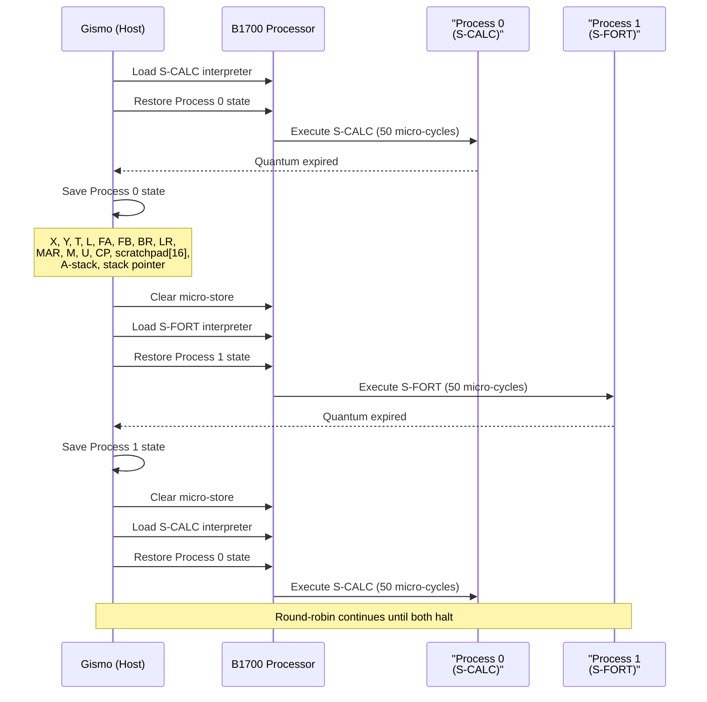

# S-Language Interpreters & Gismo Switching

> The B1700's defining feature: software-defined instruction sets, demonstrated
> with two custom interpreters and operating system-level interpreter switching.

---

## Table of Contents

- [The Concept](#the-concept)
- [S-CALC: A Stack Machine](#s-calc-a-stack-machine)
- [S-FORT: A Register Machine](#s-fort-a-register-machine)
- [Gismo: Interpreter Switching](#gismo-interpreter-switching)
- [Writing Your Own S-Language](#writing-your-own-s-language)
- [Running the Demos](#running-the-demos)

---

## The Concept

On a conventional computer, the instruction set is fixed in hardware. The CPU always understands ADD, MOV, JMP regardless of whether you're running COBOL or FORTRAN.

The B1700 has no fixed instruction set. Instead, it has 24 primitive micro-operators (move, add, branch, etc.) and a microcode interpreter that defines what "instructions" the programmer sees. Each programming language gets its own interpreter:

```
COBOL source ──► COBOL compiler ──► S-COBOL bytecode ──► S-COBOL interpreter (microcode)
                                                                    │
FORTRAN source ─► FORTRAN compiler ─► S-FORT bytecode ──► S-FORT interpreter (microcode)
                                                                    │
                                                              24 micro-operators
                                                                    │
                                                               Hardware (wires)
```

When the OS switches from a COBOL process to a FORTRAN process, it doesn't just save registers. It replaces the interpreter microcode in the CPU's control store. The same transistors that were executing S-COBOL instructions a moment ago are now executing S-FORT instructions. The CPU has literally become a different machine.

This project demonstrates the concept with two custom S-languages:
- S-CALC: a stack machine (like a reverse-Polish calculator)
- S-FORT: a register machine (like a simplified FORTRAN architecture)

And Gismo (the B1700's real interpreter dispatcher) switching between them at runtime.

---

## S-CALC: A Stack Machine

### Architecture

S-CALC is a zero-address stack machine: all operands come from and go to a stack. There are no registers visible to the S-CALC programmer, only PUSH, ADD, PRINT, etc.

| Parameter | Value |
|-----------|-------|
| **Word size** | 24-bit integers |
| **Opcodes** | 8 (1-byte each) |
| **Operands** | 3-byte big-endian (for PUSH) |
| **Stack** | In S-memory at bit address 0x8000, growing upward |
| **Interpreter size** | 120 microcode words (240 bytes) |

### Instruction Set

| Opcode | Hex | Operand | Description |
|--------|-----|---------|-------------|
| HALT | 0x00 | — | Stop execution |
| PUSH | 0x01 | 3 bytes | Push 24-bit value onto stack |
| ADD | 0x02 | — | Pop two, push sum |
| SUB | 0x03 | — | Pop two, push difference |
| MUL | 0x04 | — | Pop two, push product (repeated addition) |
| PRINT | 0x05 | — | Pop top, output via MONITOR |
| DUP | 0x06 | — | Duplicate top of stack |
| SWAP | 0x07 | — | Swap top two elements |

### Interpreter Implementation

The S-CALC interpreter is written in MIL (160 lines, assembles to 120 microcode words). Here's the core interpreter loop:

```
; ── Interpreter fetch loop ──────────────────────────
FETCH:
    XCH S1 F S0          ; Switch to S-code context (FA→program)
    READ 8 BITS TO X INC FA     ; Fetch opcode byte, advance FA
    XCH S1 F S0          ; Switch back to interpreter context

    ; ── Decode: sequential compare ──
    LIT 0 TO Y
    IF X EQL Y GO TO DO_HALT

    LIT 1 TO Y
    IF X EQL Y GO TO DO_PUSH

    LIT 2 TO Y
    IF X EQL Y GO TO DO_ADD
    ; ... etc for each opcode ...
```

Key technique: XCH context switching. The interpreter uses scratchpad entry S0 to store FA:FB for the S-code program, and S1 to store FA:FB for the interpreter's own data. The `XCH S1 F S0` instruction swaps these contexts, allowing the interpreter to fetch S-instructions from the program area and then return to its own data area.

### How ADD Works (Micro-level)

```
DO_ADD:
    ; Pop first operand
    XCH S1 F S0                ; Switch to stack context
    LIT 24 TO FL               ; Field length = 24 bits
    CALL STACK_DEC              ; SP -= 24
    READ 24 BITS FROM X        ; Read top of stack → X
    XCH S1 F S0                ; Back to interpreter context
    MOVE X TO T                 ; Save first operand in T

    ; Pop second operand
    XCH S1 F S0
    CALL STACK_DEC
    READ 24 BITS FROM Y        ; Read second → Y
    XCH S1 F S0

    ; Compute and push result
    MOVE SUM TO X              ; X = X + Y (function box, combinatorial)
    XCH S1 F S0
    WRITE X 24 BITS            ; Push result to stack
    CALL STACK_INC              ; SP += 24
    XCH S1 F S0

    GO TO FETCH                ; Next instruction
```

Every S-CALC instruction decomposes into 10-30 micro-operators. The `MOVE SUM TO X` instruction reads the Function Box's SUM output, a purely combinatorial operation with no explicit "add" command needed.

### Example: (3 + 4) × 2 = 14

```
; demo2.scalc
PUSH 3
PUSH 4
ADD         ; stack: [7]
PUSH 2
MUL         ; stack: [14]
PRINT       ; outputs 14
HALT
```

Output: `[MONITOR] PRINT: 14 (0x00000E)`, halted after 589 cycles.

---

## S-FORT: A Register Machine

### Architecture

S-FORT is a three-address register machine: instructions specify source and destination registers explicitly, similar to FORTRAN or a RISC architecture.

| Parameter | Value |
|-----------|-------|
| **Word size** | 24-bit integers |
| **Registers** | R0-R3 (stored in scratchpad S4-S7) |
| **Opcodes** | 10 (1-byte each) |
| **Operands** | Variable: register IDs (1 byte each) + 16-bit immediates |
| **Interpreter size** | 211 microcode words (422 bytes) |

### Instruction Set

| Opcode | Hex | Format | Description |
|--------|-----|--------|-------------|
| HALT | 0x00 | — | Stop execution |
| LOAD | 0x01 | Rd, imm16 | Rd ← immediate |
| ADD | 0x02 | Rd, Rs1, Rs2 | Rd ← Rs1 + Rs2 |
| SUB | 0x03 | Rd, Rs1, Rs2 | Rd ← Rs1 - Rs2 |
| MUL | 0x04 | Rd, Rs1, Rs2 | Rd ← Rs1 × Rs2 |
| MOV | 0x05 | Rd, Rs | Rd ← Rs |
| CMP | 0x06 | Rs1, Rs2 | Set flag (result in S1A) |
| BEQ | 0x07 | target16 | Branch if equal |
| BNE | 0x08 | target16 | Branch if not equal |
| PRINT | 0x09 | Rs | Output register via MONITOR |

### Register Access via Jump Tables

S-FORT's registers R0–R3 live in scratchpad entries S4–S7. Accessing them requires computing which scratchpad entry to use based on the register ID byte.

The interpreter uses a **CALL/EXIT jump table** pattern:

```
; ── Read register: R[id] → X ──────────────────
READ_REG:
    ; X contains register ID (0–3)
    ; Dispatch via computed branch
    LIT 0 TO Y
    IF X EQL Y GO TO .RR0
    LIT 1 TO Y
    IF X EQL Y GO TO .RR1
    LIT 2 TO Y
    IF X EQL Y GO TO .RR2
    GO TO .RR3

.RR0:   LOAD X FROM S4A
        GO TO .RR_DONE
.RR1:   LOAD X FROM S5A
        GO TO .RR_DONE
.RR2:   LOAD X FROM S6A
        GO TO .RR_DONE
.RR3:   LOAD X FROM S7A
.RR_DONE:
    EXIT                        ; Return to caller
```

A similar `WRITE_REG` routine stores X into the appropriate scratchpad entry. These routines are called from every instruction that accesses registers, making the interpreter modular despite the B1700's lack of indirect addressing.

### Example: Fibonacci Sequence (First 10 Numbers)

```
; fibonacci.sfort
        LOAD R0, 1          ; R0 = current
        LOAD R1, 0          ; R1 = previous
        LOAD R2, 10         ; R2 = counter
        LOAD R3, 1          ; R3 = constant 1

LOOP:   PRINT R0             ; Output current number
        MOV R1, R0           ; Save current
        ADD R0, R0, R1       ; Actually: need temp...
```

*(The actual Fibonacci implementation uses careful register shuffling since there are only 4 registers.)*

Output:
```
[MONITOR] PRINT: 1 (0x000001)
[MONITOR] PRINT: 1 (0x000001)
[MONITOR] PRINT: 2 (0x000002)
[MONITOR] PRINT: 3 (0x000003)
[MONITOR] PRINT: 5 (0x000005)
[MONITOR] PRINT: 8 (0x000008)
[MONITOR] PRINT: 13 (0x00000D)
[MONITOR] PRINT: 21 (0x000015)
[MONITOR] PRINT: 34 (0x000022)
[MONITOR] PRINT: 55 (0x000037)
System halted at cycle 13660  MAR=0x00070
```

13,660 micro-cycles to compute 10 Fibonacci numbers. Each S-FORT instruction takes 20-60 micro-ops.

---

## Gismo: Interpreter Switching

### What Is Gismo?

Gismo is the B1700's interpreter dispatcher, the part of MCP responsible for managing which interpreter is loaded in the CPU's control store. On the real B1700, Gismo:

1. Tracks which interpreters are currently loaded
2. Manages M-Memory allocation (B1720) with five pressure levels: Abundant (<20%), Ample (20–40%), Adequate (40–60%), Precious (60–80%), Bare (>80%)
3. Performs context switches by saving/restoring process state and overlaying new microcode

The emulator's implementation demonstrates the core of this: preemptive interpreter switching between two programs with different instruction sets.

### How It Works



### Context Switch Details

Every context switch saves and restores **the complete processor state**:

```cpp
struct ProcessState {
    // Data path
    reg24_t X, Y, T, L;

    // Address/control
    reg24_t FA, FB;
    reg24_t BR, LR;
    uint32_t MAR;
    reg16_t M;
    reg16_t U;
    uint8_t  CP;

    // Scratchpad (16 × 48 bits = 16 × 2 × 24 bits)
    reg24_t scratchpad[32];    // left/right halves interleaved

    // A-stack
    reg24_t a_stack[16];
    uint8_t stack_ptr;
};
```

The microcode overlay is faithful to the real B1700:
1. **Clear** the micro-store region (0x000–0x3FF)
2. **Load** the new interpreter binary from a file into micro-store
3. This is exactly what the real Gismo did, copying microcode from S-Memory (or M-Memory on B1720) into the control store

### Memory Layout (Gismo Mode)

```
Bit Address  │ Contents
─────────────┼──────────────────────────────
0x00000      │ Interpreter microcode (OVERLAID on each switch)
             │   ← S-CALC interpreter (240 bytes) -OR-
             │   ← S-FORT interpreter (422 bytes)
0x04000      │ S-CALC program + data (Process 0)
0x06000      │ S-FORT program + data (Process 1)
0x08000      │ S-CALC stack area
```

Each process has its own program area that persists across context switches. Only the microcode region at 0x00000 is overlaid.

### Running the Demo

```bash
cd build

# Assemble interpreters
./mil_asm ../artifacts/interpreters/s_calc_interp.mil s_calc.bin
./mil_asm ../artifacts/interpreters/s_fort_interp_gismo.mil s_fort.bin

# Compile programs
./scalc_asm ../artifacts/programs/gismo_calc.scalc calc.bin
./sfort_asm ../artifacts/programs/gismo_fib.sfort fib.bin

# Run with Gismo switching
./b1700 --gismo s_calc.bin calc.bin s_fort.bin fib.bin --quantum 50
```

**Output:**
```
╔══════════════════════════════════════════════════════════════╗
║          BURROUGHS B1700 — GISMO INTERPRETER SWITCHING      ║
╚══════════════════════════════════════════════════════════════╝

 Process 0 : S-CALC  (stack machine)     interp=240 B  code=44 B
 Process 1 : S-FORT  (register machine)  interp=422 B  code=62 B
 Quantum   : 50 micro-cycles per slice

[S-CALC ] PRINT: 10 (0x00000A)
[S-CALC ] PRINT: 20 (0x000014)
[S-CALC ] PRINT: 30 (0x00001E)
[S-FORT ] PRINT: 1 (0x000001)
[S-FORT ] PRINT: 1 (0x000001)
[S-CALC ] PRINT: 40 (0x000028)
[S-CALC ] PRINT: 50 (0x000032)
[S-FORT ] PRINT: 2 (0x000002)
[S-FORT ] PRINT: 3 (0x000003)
[S-FORT ] PRINT: 5 (0x000005)

── Summary ─────────────────────────────────────────────────
  Context switches : 28
  S-CALC cycles    : 1520
  S-FORT cycles    : 6980
  Both programs    : completed correctly
```

Notice the interleaved output. S-CALC prints 10, 20, 30, then Gismo switches to S-FORT which prints 1, 1, then back to S-CALC for 40, 50, then S-FORT finishes with 2, 3, 5. The same physical "CPU" is alternating between being a stack machine and a register machine.

### Why This Matters

This demo makes visible what the real B1700 did thousands of times per second in production:
- A **COBOL** program would be processing records with decimal arithmetic
- The timer interrupt fires (CC(2), every 100ms)
- Gismo saves the COBOL process state and overlays the **FORTRAN** interpreter
- The CPU is now a FORTRAN machine, running scientific calculations
- Another timer interrupt → Gismo switches to **RPG** for report generation
- Same transistors, completely different instruction sets, all transparent to the programs

---

## Writing Your Own S-Language

### Step 1: Design the Instruction Set

Choose opcodes, operand formats, and addressing modes appropriate for your language:

```
; Example: S-LISP (hypothetical)
; Opcodes: NIL(0), CONS(1), CAR(2), CDR(3), ATOM(4), EQ(5), COND(6), PRINT(7)
; Operands: pointer sizes, tag bits, etc.
```

### Step 2: Write the MIL Interpreter

Use the S-CALC interpreter as a template. The overall structure is always:

```
SEGMENT S_LANG_INTERP START 0

; ── Initialize ──
    LIT [stack_base] TO FA
    STORE FA INTO S1A           ; Save stack context
    LIT [code_base] TO FA
    STORE FA INTO S0A           ; Save code context

; ── Fetch loop ──
FETCH:
    XCH S1 F S0                ; Switch to code
    READ [opcode_bits] TO X INC FA
    XCH S1 F S0                ; Switch back

    ; Decode (compare X against each opcode)
    LIT [opcode_0] TO Y
    IF X EQL Y GO TO HANDLER_0
    ; ...

; ── Handlers ──
HANDLER_0:
    ; ... micro-operator sequence ...
    GO TO FETCH
```

### Step 3: Write the Assembler

Create a source-to-binary tool (like `scalc_asm` or `sfort_asm`) that converts your S-language assembly into binary:

```cpp
// Minimal assembler pattern
std::map<std::string, uint8_t> opcodes = {
    {"NIL", 0}, {"CONS", 1}, {"CAR", 2}, ...
};
// Parse input, emit bytes, handle labels if needed
```

### Step 4: Assemble and Run

```bash
./mil_asm my_interp.mil my_interp.bin
./my_asm my_program.src my_program.bin
./b1700 --interp my_interp.bin --scode my_program.bin --run
```

### Tips

- **Use XCH for context switching** between your interpreter's data and the S-code program
- **Use the scratchpad** for register storage (S-FORT uses S4–S7)
- **Use CALL/EXIT** for reusable subroutines in the interpreter (S-FORT's READ_REG/WRITE_REG pattern)
- MONITOR (opcode 0x0900) is your output channel, triggers the host callback with the X register value
- Test incrementally. Get HALT working first, then PUSH/LOAD, then one operation at a time

---

*For the B1700 hardware architecture, see [ARCHITECTURE.md](ARCHITECTURE.md). For emulator implementation details, see [IMPLEMENTATION.md](IMPLEMENTATION.md). For the development story, see [JOURNEY.md](JOURNEY.md).*
