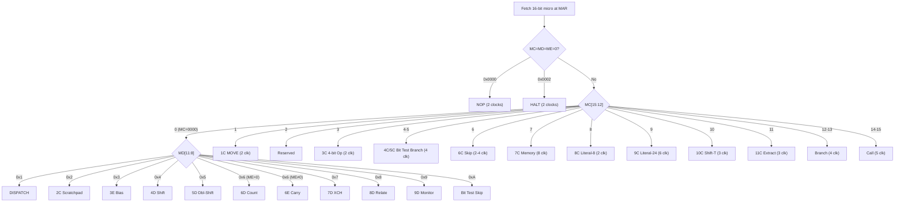

# B1700 Architecture Guide

> A comprehensive technical reference to the Burroughs B1700's hardware architecture,
> reconstructed from the 1973 Field Engineering Technical Manual and Wilner's design papers.

---

## Table of Contents

- [Overview](#overview)
- [Design Philosophy](#design-philosophy)
- [Memory System](#memory-system)
- [Register File](#register-file)
- [Micro-Instruction Format](#micro-instruction-format)
- [Instruction Decode Tree](#instruction-decode-tree)
- [The 24 Micro-Operators](#the-24-micro-operators)
- [Function Box (ALU)](#function-box-alu)
- [Field Isolation Unit](#field-isolation-unit)
- [Scratchpad Memory](#scratchpad-memory)
- [A-Stack](#a-stack)
- [I/O System](#io-system)
- [Interrupt System](#interrupt-system)
- [Console & Bootstrap](#console--bootstrap)
- [B1710 vs B1720](#b1710-vs-b1720)

---

## Overview

| Parameter | Value |
|-----------|-------|
| **Manufacturer** | Burroughs Corporation, Santa Barbara Plant, Goleta, CA |
| **Introduction** | June 1972 |
| **Designer** | Wayne T. Wilner, Ph.D. |
| **Architecture** | Dynamically microprogrammed, no fixed ISA |
| **Micro-instruction width** | 16 bits (fixed) |
| **Micro-operator count** | 24 (B1710), 28-32 (B1720) |
| **Data path width** | 24 bits |
| **Memory addressing** | Bit-addressable (24-bit bit-addresses, up to 2 MB) |
| **S-Memory** | MOS, 16K-262K bytes |
| **A-Stack depth** | 16 (B1710), 32 (B1720) |
| **Clock** | 8 MHz crystal, 4 MHz processor clock |
| **Cycle time** | 167 ns (B1720) - 500 ns (B1712) |
| **Processor cards** | A-K (11 cards, each a specific functional unit) |

---

## Design Philosophy

Wayne Wilner's insight was deceptively simple: if every language compiles to a different instruction set anyway, why fix the instruction set in hardware?

Traditional computers force a compromise. The hardware provides a fixed ISA (like x86), and every language compiler must target it. COBOL's decimal arithmetic, FORTRAN's floating-point loops, and RPG's record processing all get squeezed through the same instruction bottleneck.

Wilner proposed the opposite: each language gets its own ideal instruction set, called an S-language (S for "Software-defined"). A compiler translates COBOL to S-COBOL, a bytecode designed specifically for COBOL's needs. A separate microcode interpreter loaded into the CPU makes the hardware understand S-COBOL directly. Overlay a different interpreter and the same transistors become a FORTRAN machine.

The B1700 provides only 24 micro-operators (primitive operations like "move register to register" or "add X and Y"). Everything the programmer sees, every instruction and every addressing mode, is built from sequences of these micro-operators by the loaded interpreter.

```
        ┌──────────────────────────────────────────────────────┐
        │                                                      │
        │   COBOL Program ──► S-COBOL ──► S-COBOL Interpreter ─┤
        │                                  (loaded microcode)  │
        │                                        │             │
        │   FORTRAN Program ─► S-FORT ──► S-FORT Interpreter ──┤──► 24 Micro-operators ──► Hardware
        │                                  (loaded microcode)  │
        │                                        │             │
        │   RPG Program ────► S-RPG ───► S-RPG Interpreter ────┤
        │                                  (loaded microcode)  │
        │                                                      │
        └──────────────────────────────────────────────────────┘
```

Wilner claimed this yielded programs **1/10th the size** of conventional code, because S-instructions could be perfectly tailored to each language's semantics.

---

## Memory System

### Bit-Addressable Memory

The B1700's most unusual hardware feature is bit-addressable memory. While conventional machines address bytes (or words), every address in the B1700 refers to an individual bit.

```
Byte address 0x005   =   Bit address 0x028   (5 × 8 = 40 = 0x28)
Byte address 0x100   =   Bit address 0x800   (256 × 8 = 2048)
```

The FA register (Field Address, 24-bit) holds the current bit address for S-memory operations. The FL register (Field Length, 16-bit) specifies how many bits to transfer (1-65,535). Together, FA+FL define an arbitrary bit field anywhere in memory.

```
Memory:   ... [byte N-1] [byte N  ] [byte N+1] [byte N+2] ...
Bits:     ... 7654 3210  7654 3210  7654 3210  7654 3210 ...
                         ▲─── FA points here
                         ├────────────── FL = 20 bits ──────────────┤
                         │  Field Isolation Unit extracts these bits │
```

### S-Memory

| Parameter | B1710 | B1720 |
|-----------|-------|-------|
| Technology | MOS | MOS |
| Capacity | 16K–262K bytes | 16K–262K bytes |
| Read cycle | 500–1000 ns | 667 ns |
| Write cycle | 1000–1500 ns | 1000 ns |
| Bus width | 32 bits (24 data + 8 overhead) | 32 bits |
| Organization | Paired boards, 4K modules | Paired boards |
| Parity | Odd, per byte | Odd, per byte |

S-Memory stores everything: microcode, S-language programs, data, and stack. On the B1710, even the active interpreter lives in S-Memory. The B1720 adds faster M-Memory for the active interpreter.

### M-Memory (B1720 Only)

Bipolar SRAM, 2K–8K bytes, with 167/225 ns cycle time (~6× faster than S-Memory). Stores the active interpreter's microcode. On interpreter switch, the OS copies new microcode from S-Memory into M-Memory.

### Memory Protection

The BR (Base Register) and LR (Limit Register) define a memory window: `BR <= address < BR + LR`. The hardware does not trap on violations. Protection is software-enforced by the interpreter or MCP. Programs are location-independent through PC-relative branching and base-relative addressing.

---

## Register File

The B1700 organizes its registers as a 16-group x 4-select matrix (64 possible slots, not all populated). Each register is addressed by a 4-bit group and 2-bit select field encoded in micro-instructions.

### Complete Register Map (Table I-3)

```
 Group │ Select 0   │ Select 1   │ Select 2   │ Select 3
═══════╪════════════╪════════════╪════════════╪═══════════
   0   │ TA    (4b) │ TB    (4b) │ TC    (4b) │ TD    (4b)
   1   │ TE    (4b) │ TF    (4b) │ —          │ —
   2   │ FU    (4b) │ FT    (4b) │ FLC   (4b) │ FLD   (4b)
   3   │ FLE   (4b) │ FLF   (4b) │ —          │ —
   4   │ X    (24b) │ Y    (24b) │ T    (24b) │ L    (24b)
   5   │ MAR  (19b) │ M    (16b) │ BR   (24b) │ LR   (24b)
   6   │ SUM* (24b) │ CMPX*(24b) │ CMPY*(24b) │ XANY*(24b)
   7   │ XEQY*(24b) │ MSKX*(24b) │ MSKY*(24b) │ XORY*(24b)
   8   │ FA   (24b) │ FB   (24b) │ FL   (16b) │ DIFF*(24b)
   9   │ MAXS (24b) │ MAXM (24b) │ —          │ —
  10   │ —          │ —          │ TAS  (24b) │ U    (16b)
  11   │ —          │ —          │ CP    (8b) │ —
  12   │ BICN  (4b) │ FLCN  (4b) │ XYCN  (4b) │ XYST  (4b)
  13   │ CA    (4b) │ CB    (4b) │ CC    (4b) │ CD    (4b)
  14   │ CPU   (2b) │ —          │ READ (24b) │ CMND (24b)
  15   │ WRIT (24b) │ NULL (24b) │ DATA (24b) │ —
```

*\* Groups 6-7 and DIFF are Function Box outputs, combinatorial (read-only), computed from current X and Y values.*

### Key Registers

**Data Path Registers:**
- **X** (4/0, 24-bit): Left ALU operand, memory read/write source
- **Y** (4/1, 24-bit): Right ALU operand
- **T** (4/2, 24-bit): Transform register. Contains six 4-bit sub-fields TA–TF. Target for shift/extract operations.
- **L** (4/3, 24-bit): Logical register. Six 4-bit sub-fields LA–LF.

**Address Registers:**
- **FA** (8/0, 24-bit): Field Address, bit-address for S-memory operations
- **FB** (8/1, 24-bit): Field descriptor (packed FU|FT|FL)
- **FL** (8/2, 16-bit): Field Length for memory operations
- **MAR** (5/0, 19-bit): Micro Address Register, program counter for microcode. Lower 4 bits forced to 0 (16-bit alignment). Writing to MAR = branch (+2 extra clocks).

**Control Registers:**
- **M** (5/1, 16-bit): Current micro-instruction. Writes OR with the next incoming micro-instruction (overlay technique).
- **CP** (11/2, 8-bit): Packed control: CPL (5 bits, data width 1–24) | CPU (2 bits: binary/BCD) | CYF (1 bit, carry flag)
- **BR** / **LR** (5/2, 5/3): Base Register / Limit Register for memory protection

**Stack & Subroutine:**
- **TAS** (10/2, 24-bit): A-stack top. Write = push (pointer++), Read = pop (pointer--)

**I/O Registers:**
- **CMND** (14/3, write-only): Places 24-bit command on I/O bus, asserts CA signal
- **DATA** (15/2, read/write): I/O data transfer, asserts RC signal
- **BICN** (12/0, 4-bit, read-only): I/O bus status conditions

**Condition Registers (read-only):**
- **XYCN** (12/2, 4-bit): Bit 0=X>Y, Bit 1=X<Y, Bit 2=X=Y, Bit 3=MSB of X
- **FLCN** (12/1, 4-bit): Bit 0=FL=0, Bit 1=FL<SFL, Bit 2=FL>SFL, Bit 3=FL=SFL
- **XYST** (12/3, 4-bit): Bit 2=INT OR (any interrupt pending)
- **CC** (13/2, 4-bit): CC(0)=Console, CC(1)=I/O Bus, CC(2)=Timer (100ms), CC(3)=State lamp
- **CD** (13/3, 4-bit): CD(3)=Memory parity error

**Special:**
- **NULL** (15/1): Always reads 0, writes discarded. Used for console display/load operations.
- **U** (10/3, 16-bit, read-only): Cassette tape accumulator (bit-serial). Stalls if not full.
- **MAXS** / **MAXM** (9/0, 9/1): Hardwired memory size constants.

---

## Micro-Instruction Format

Every micro-instruction is exactly 16 bits, divided into four 4-bit fields:

```
 15  14  13  12 │ 11  10   9   8 │  7   6   5   4 │  3   2   1   0
────────────────┼────────────────┼────────────────┼────────────────
    MC[15:12]   │    MD[11:8]    │     ME[7:4]    │     MF[3:0]
────────────────┼────────────────┼────────────────┼────────────────
    (opcode)    │  (varies by    │  (varies by    │  (varies by
                │   instruction) │   instruction) │   instruction)
```

MC[15:12] is always the opcode. This was not obvious from the manual. It took a complete encoding redesign (Phase 8) to establish this definitively. The sub-fields MD, ME, MF have different meanings for each instruction class.

### Encoding Examples

```
1C MOVE X TO Y:           MC=1  MD=4(grp4) ME=0(src=X)  MF=1(dst=Y)  → 0x1401
8C LIT 0x42 TO T:         MC=8  MD=4(grp4) ME=4         MF=2(sel=2)  → 0x8442
7C READ 8 BITS TO X:      MC=7  MD=flags   ME=len       MF=count     → 0x7040
Branch to +5:             MC=C  MD/ME/MF = 12-bit displacement        → 0xC005
```

---

## Instruction Decode Tree

The decode tree determines which micro-operator executes based on MC[15:12]. The order matters, some patterns overlap, and priority determines the winner.



### Timing Summary

| MC | Instruction | Clocks | Description |
|----|-------------|--------|-------------|
| 0 | D-class | 2–6 | Secondary decode by MD |
| 1 | 1C MOVE | 2 | Register-to-register transfer (+2 if dest=MAR) |
| 3 | 3C | 2 | 4-bit SET/AND/OR/XOR/INC/DEC |
| 4/5 | 4C/5C | 4 | Bit test and branch (signed 7-bit displacement) |
| 6 | 6C | 2–4 | Conditional skip (groups 0–3 only) |
| 7 | 7C | 8 | Memory read/write via FIU |
| 8 | 8C | 2 | Load 8-bit literal (dest_select=2 always) |
| 9 | 9C | 6 | Load 24-bit literal (two-word, dest_select=2 always) |
| 10 | 10C | 3 | Shift/Rotate T register |
| 11 | 11C | 3 | Extract bit field from T |
| 12/13 | Branch | 4 | PC-relative, 12-bit signed displacement |
| 14/15 | Call | 5 | Branch + push return address to A-stack |

### The Literal Trap (8C/9C)

A critical subtlety: 8C and 9C always force dest_select=2. The group field specifies which group's select-2 slot receives the value. For group 4, select 2 is T, not X or Y. This means:

```asm
LIT 42 TO X        ; WRONG, actually loads 42 into T (group 4, select 2)

; Correct pattern:
LIT 42 TO T        ; 8C: loads into T
MOVE T TO X        ; 1C: then move to X
```

The assembler handles this transparently with `emit_literal()`, which detects when the programmer writes `LIT n TO X` and automatically emits the two-instruction sequence.

---

## The 24 Micro-Operators

### Primary C-Class

**1C: MOVE** (2 clocks, +2 if dest=MAR)
```
MD[11:8] = group    ME[7:4] = source_select:variant    MF[3:0] = dest_select:variant
Variants: V=0 simple, V=1 move+skip, V=2 function box source, V=3 special
```
Transfer a 24-bit value between any two registers. Width mismatch: source > dest = truncate MSB; source < dest = right-justify, zero-fill.

Writing to M (the micro-instruction register) ORs the value with the next fetched micro, an overlay technique used by the Cold Start Loader.

**3C: 4-bit Operation** (2 clocks)
```
Operations: SET nibble = literal, AND, OR, XOR, INC, DEC
Targets: TA–TF, LA–LF, CA–CD, FU, FT, and other 4-bit registers
```

**6C: Conditional Skip** (2-4 clocks)
```
Groups 0–3 ONLY (higher groups conflict with decode tree)
V=0: any bits set    V=1: equal    V=2: no bits set    V=3: match then clear
```
Only usable for 4-bit condition registers in groups 0–3. For groups 4+ conditions, use D-class Bit Test Skip instead.

**7C: Memory** (8 clocks)
```
[11]=direction (0=read, 1=write)    [10:9]=register (X/Y/T/L)
[8]=reverse byte order              [7:3]=field_length    [2:0]=count_variant
Count variants: 000=none, 001=FA↑, 010=FL↑, 011=FA↑FL↓, 100=FA↓FL↑, 101=FA↓, 110=FL↓, 111=FA↓FL↓
```
Read or write an arbitrary bit field between memory and a register, with optional automatic increment/decrement of FA and FL by the field length.

**8C / 9C: Literals** (2 / 6 clocks)
```
8C: 8-bit literal in MD[11:4], forced dest_select=2
9C: 24-bit literal in following word, forced dest_select=2
```
Always writes to select-2 of the specified group. Two-word for 9C (literal in second word).

**10C: Shift T** (3 clocks)
```
Left/right shift or rotate of T register by ME[6:4] positions
```

**11C: Extract** (3 clocks)
```
Extract a bit field from T: start position in ME, length in MF
```

**12C/13C: Branch** (4 clocks)
```
MC[15:13]=110 or 111, lower 12 bits = signed word displacement
MAR += displacement × 16 (bit address)
```

**14C/15C: Call** (5 clocks)
```
Same as branch, but pushes (MAR+16) to A-stack before branching
```

### D-Class Secondary Operations (MC=0)

All secondary operations have MC=0000 and are decoded by the **MD** field:

**2C: Scratchpad** (3 clocks): Move between registers and the 16x48-bit scratchpad. Four variants: reg->pad.Left, reg->pad.Right, pad.Left->reg, pad.Right->reg.

**3E: Bias** (2 clocks): Set CPU mode (binary/BCD) and CPL (data width) from FU/FL fields.

**4D: Shift** (3 clocks): Shift or rotate X or Y by 1 position.

**5D: Double Shift** (6 clocks): Shift the concatenated 48-bit X:Y by 1 bit.

**6D: Count** (4 clocks): Increment/decrement FA and/or FL using the same count variant encoding as 7C.

**6E: Carry Manipulate** (2 clocks): V=1: CYF<-0, V=2: CYF<-1, V=4: CYF<-CYL (ALU carry-out), V=8: CYF<-CYD.

**7D: XCH (Exchange)** (4 clocks): Exchange FA:FB with a scratchpad doubleword. This is the key instruction for context switching, swapping the current S-code execution context with a saved one.

**8D: Relate** (4 clocks): FA += scratchpad value (base-relative addressing).

**9D: Monitor** (2 clocks): Breakpoint/trace instruction with a literal ID. In the emulator, triggers a host callback for S-language PRINT operations.

**Bit Test Skip (MD=0xA)** (2 clocks): Test a single bit in any 4-bit register and conditionally skip the next instruction.
```
[7]=sense  [6:3]=register_index(4-bit)  [2:1]=bit_position  [0]=0
```

**DISPATCH (MD=0x1)**: Multiway branch used for I/O multiplexing. Variants: LOCK, WRITE, READ_AND_CLEAR.

---

## Function Box (ALU)

The Function Box is combinatorial. All outputs are available simultaneously as pseudo-register reads, computed from the current X and Y values. There is no "execute ALU" instruction; you simply read the result you want.

```
 X ──────┐                    ┌── SUM   (6/0)  = X + Y
         │                    ├── DIFF  (8/3)  = X - Y
         ├──► Function Box ───├── CMPX  (6/1)  = (X>Y) ? X : 0
         │    (Card F)        ├── CMPY  (6/2)  = (X>Y) ? 0 : Y
 Y ──────┘                    ├── XANY  (6/3)  = X AND Y
                              ├── XEQY  (7/0)  = (X==Y) ? 0xFFFFFF : 0
                              ├── MSKX  (7/1)  = X AND NOT Y
  CP ─────────────────────────├── MSKY  (7/2)  = NOT X AND Y
  (CPL, CPU, CYF)             ├── XORY  (7/3)  = X XOR Y
                              └── XYCN  (12/2) = condition bits
```

### BCD Mode

When CPU=01 (BCD mode), the SUM and DIFF outputs apply per-nibble BCD correction. The CPL field (1-24) masks the effective width, and bits beyond CPL are zeroed.

### Carry Behavior

**CYF is NOT automatically set by arithmetic.** This is a deliberate design choice to prevent side effects. After addition, the programmer must explicitly capture carry:

```asm
MOVE SUM TO X           ; X ← X + Y (carry lost!)
SET CARRY FROM CYL      ; 6E: CYF ← carry-out from last SUM
```

The carry-dignit flag CYD enables multi-precision arithmetic: CYD = (X≠Y) + (X=Y)×CYF.

---

## Field Isolation Unit

The FIU (Card H) is a **64-bit barrel rotator + mask generator** that enables the B1700's bit-addressable memory operations.

### Read Operation

```
Memory ──► [64-bit buffer] ──► [Barrel Rotator] ──► [Mask Generator] ──► Register
                                (rotate by bit       (mask to FL bits,
                                 offset within        right-justified)
                                 word boundary)
```

### Write Operation

```
Register ──► [Barrel Rotator] ──► [Merge with memory] ──► Memory
              (rotate to bit        (only FL bits
               offset position)      are modified)
```

The FIU is what makes bit-addressable memory practical. A `READ 12 BITS TO X` starting at bit address 37 means: read spanning bytes 4–6, rotate to extract bits 37–48, mask to 12 bits, right-justify into X.

Micro-instruction fetch **bypasses** the rotator because MAR is always 16-bit aligned (lower 4 bits forced to 0).

---

## Scratchpad Memory

16 entries × 48 bits each. Each entry has a **left half** (24 bits) and **right half** (24 bits), accessed independently via the 2C instruction.

```
Scratchpad Entry Layout:
┌─────────────────────────┬─────────────────────────┐
│    Left Half (24 bits)  │   Right Half (24 bits)  │
└─────────────────────────┴─────────────────────────┘

Accessed via 2C:
  STORE X INTO S3A    ; reg → scratchpad[3].left
  LOAD Y FROM S3B     ; scratchpad[3].right → reg
```

### Special Uses

- **S0**: Context save area. 7D (XCH) exchanges FA:FB with a scratchpad doubleword (left=FA, right=FB).
- **S0B (right of entry 0)**: Contains SFL/SFU values used by FLCN condition bits for field length comparison.
- **8D (Relate)**: FA += scratchpad[n].left, used for base-relative addressing.

In the S-FORT interpreter, scratchpad entries S4-S7 store the four registers R0-R3, with the left half holding the register value.

---

## A-Stack

A hardware stack used exclusively for CALL/EXIT (subroutine linkage):

- **CALL** (14C/15C): Pushes MAR+16 (return address) onto A-stack, then branches
- **EXIT** (MOVE TAS TO MAR): Pops return address from A-stack into MAR
- **Depth**: 16 entries (B1710), 32 entries (B1720)
- **TAS** pseudo-register: Write = push, Read = pop

The A-stack is **not** a general-purpose data stack. S-language stacks (like S-CALC's operand stack) are implemented in S-Memory, not on the A-stack.

---

## I/O System

### Bus Architecture

The B1700 uses a parallel I/O bus supporting up to 14 I/O controls (devices):

```
                    ┌──────────────┐
                    │   Processor  │
                    │  CMND / DATA │
                    └──────┬───────┘
                           │ 24-bit parallel bus
           ┌───────┬───────┼───────┬───────┐
           │       │       │       │       │
        ┌──┴──┐ ┌──┴──┐ ┌──┴──┐ ┌──┴──┐ ┌──┴──┐
        │Port0│ │Port1│ │Port2│ │Port3│ │ ... │
        │Disk │ │Tape │ │Card │ │Print│ │     │
        └─────┘ └─────┘ └─────┘ └─────┘ └─────┘
```

### Protocol

1. **Command**: Write to CMND register → asserts CA signal on bus
2. **Data Transfer**: Read/Write DATA register → asserts RC signal
3. **Service Request**: Device sets SR → CC(1) interrupt → software polls BICN for source
4. **Status**: BICN (4/0) provides bus condition flags

### EMV Protocol (Implemented)

The EMV (Emulator/Virtual) protocol is the emulator's implementation of the CSL's card reader interface:

1. CSL writes I/O descriptor to port 2
2. EMVHostControl provides START-M-LOAD preamble (unit type 0x0C = card reader)
3. Card images (80 bytes each) are served on demand
4. "//M" header card validates card reader presence
5. "/EN" sentinel card signals end of card deck

---

## Interrupt System

The B1700 has soft interrupts only, with no hardware vectoring, no automatic register save, and no processor mode switch.

### Sources

| Bit | Source | Period | Notes |
|-----|--------|--------|-------|
| CC(0) | Console button | Manual | Operator pressed INTERRUPT |
| CC(1) | I/O Bus SR | Async | Any device service request |
| CC(2) | Timer | 100 ms | From AC power, real-time clock |
| CD(3) | Memory parity | Async | Read error detected |

### Polling Mechanism

```asm
; Fast check: any interrupt at all?
SKIP WHEN XYST BIT 2 SET          ; INT OR = OR of all CC/CD bits
GO TO NO_INTERRUPT                  ; skip if none

; Priority poll (convention: parity > timer > I/O > console)
SKIP WHEN CD BIT 3 SET             ; memory parity?
GO TO .CHECK_TIMER
; ... handle parity error ...
```

**XYST(2)** is the fast-path: a single OR of all interrupt conditions. If clear, no interrupts are pending and the interpreter can skip the full polling sequence.

Clearing an interrupt requires writing to the CC/CD register. The hardware source may re-assert if the condition persists (e.g., a device still requesting service).

---

## Console & Bootstrap

### Physical Console

The B1700 console provides:
- 24 lamps (display the Main Exchange bus)
- 24 switches (data input)
- Group/Select rotary dials (register selection)
- Mode switch: Step (single micro per Start press), Run (continuous), Tape (execute from cassette)
- Buttons: Start, Halt, Load, Read-Write, Interrupt, Rewind
- Indicators: Run, BOT (cassette beginning-of-tape), Tape Parity

### Bootstrap Sequence


**GPCLR** (General Processor Clear): Clears all registers and memory, halts at address 0.

In the emulator, the cassette is bypassed and the assembled CSL binary is loaded directly. The CSL then:
1. Passes through OVERLAY (FA=FB=0 → boot entry)
2. Clears 32K of S-memory
3. Initializes EMV I/O on port 2
4. Reads card deck via EMV protocol
5. Processes "//M" header and data cards
6. Reaches "/EN" sentinel
7. Sets FA=0x5000, hits OVERLAY again → halt (bootstrap complete)

---

## B1710 vs B1720

| Feature | B1710 Class | B1720 Class |
|---------|-------------|-------------|
| **Models** | B1705/07/09/13/17 | B1720-1, B1724 |
| **Cycle time** | 250–500 ns | 167 ns |
| **A-Stack depth** | 16 | 32 |
| **Micro-operators** | 24 | 28–32 |
| **M-Memory** | None (use S-Memory) | 2K–8K bipolar |
| **M-Memory speed** | — | 167/225 ns (~6× S-Mem) |
| **S-Memory read** | 500–1000 ns | 667 ns |
| **Port Interchange** | — | 8-position arbiter |
| **Comms lines** | — | Up to 32 |

This emulator implements the **B1710** variant. The B1720's additional micro-operators (primarily for M-Memory management and the Port Interchange) are not yet implemented.

---

*This document was compiled from the Burroughs B1700 Field Engineering Technical Manual (1053360, May 1973), Wilner's AFIPS 1972 papers, and Organick's "Interpreting Machines" (1978). For implementation details, see [IMPLEMENTATION.md](Implementation). For the development story, see [JOURNEY.md](Journey).*
