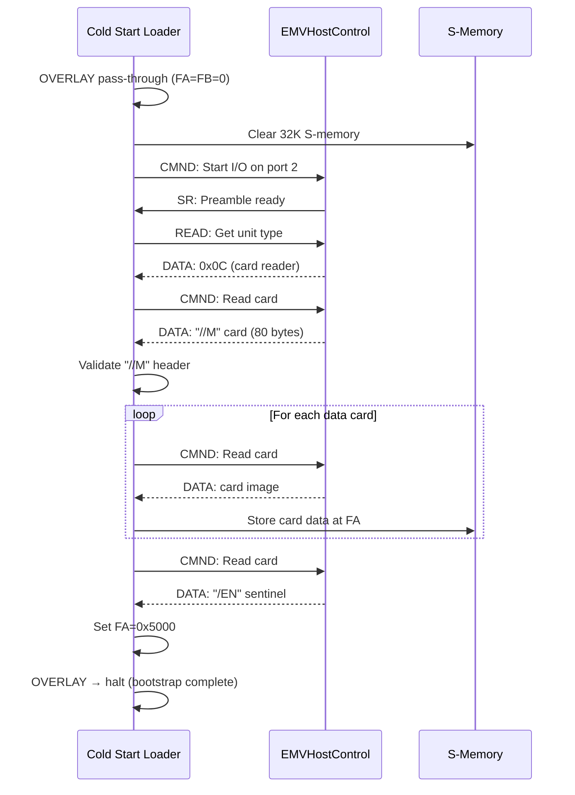

# Implementation Guide

> How this emulator was built: design decisions, C++ patterns, and practical advice
> for anyone implementing a microprogrammed architecture emulator.

---

## Table of Contents

- [Design Principles](#design-principles)
- [Code Organization](#code-organization)
- [Memory Model](#memory-model)
- [Register File Design](#register-file-design)
- [The Decode Tree](#the-decode-tree)
- [Instruction Execution](#instruction-execution)
- [The MIL Assembler](#the-mil-assembler)
- [I/O Bus & Bootstrap](#io-bus--bootstrap)
- [The Debugger](#the-debugger)
- [Testing Strategy](#testing-strategy)
- [Lessons Learned](#lessons-learned)
- [Rebuilding the Architecture from Primary Sources](#rebuilding-the-architecture-from-primary-sources)

---

## Design Principles

### 1. Header-Only Core

The entire emulator core is a set of header files in `src/core/`:

```
types.h       → Micro-instruction field decoding
memory.h      → Bit-addressable memory
registers.h   → Register file + function box
processor.h   → Decode tree + all micro-operators
io_bus.h      → I/O bus + EMV protocol
disasm.h      → Disassembler
debugger.h    → Interactive debugger
```

This is a deliberate choice. Since everything is `#include`-able, any tool (the main emulator, the test suite, the assembler's self-test) can pull in exactly what it needs without linking. The `b1700_core` CMake target is `INTERFACE`, no object files, just include paths.

The trade-off: compilation is slower (each translation unit recompiles the full core). For a ~8,000-line project, this is acceptable. If the codebase grew significantly, splitting into a static library would be the natural next step.

### 2. Cycle-Level (Not Gate-Level)

This emulator operates at the micro-instruction level: each cycle fetches, decodes, and executes one 16-bit micro-instruction. It does not model individual clock phases, pipeline bubbles, or gate propagation delays.

This is the right abstraction for the B1700, because the machine itself was designed around micro-instructions as the primitive. The manual specifies timing in terms of clock cycles per instruction, not gate delays.

### 3. Faithful to Primary Sources

Every encoding, every register address, every field accessor was derived from the 1973 Field Engineering Technical Manual. When the manual was ambiguous (which was frequent, given the quality of the scanned documents), I cross-referenced against:
- Wilner's AFIPS 1972 papers
- The surviving Cold Start Loader MIL source
- Behavioral testing (assemble → execute → verify results)

### 4. Get Something Running, Then Fix It

The project followed a relentless forward-progress strategy:
1. Implement the minimum that could conceivably work
2. Assemble real code (the CSL) and see what breaks
3. Debug the failures using the actual CSL as the specification
4. Repeat until the CSL passes

This approach discovered bugs that no amount of manual-reading would have caught (see [JOURNEY.md](Journey) for the full story). The CSL is the best test suite. It exercises every major subsystem.

---

## Code Organization

### File Responsibilities

| File | Lines | Responsibility |
|------|-------|----------------|
| `types.h` | 176 | `MicroFields` struct, per-instruction field decoders. Given a raw 16-bit micro, extracts the correct sub-fields for each instruction class. |
| `memory.h` | 103 | `BitAddressableMemory`, byte-array backed, bit-level `read()` / `write()` via shift-and-mask. `load_bytes()` for bulk binary loading. |
| `registers.h` | 524 | `RegisterFile`, all B1700 registers, A-stack, scratchpad, function box pseudo-registers. `read_register(group, select)` / `write_register()` with Table I-3 mapping. |
| `processor.h` | 809 | `Processor`, fetch/decode/execute cycle, complete decode tree, all 24 micro-operator execution functions. Contains `on_monitor` callback. |
| `io_bus.h` | 355 | `IOBus`, 14 ports, CMND/DATA/SR protocol. `EMVHostControl` for CSL card reader emulation. |
| `disasm.h` | 384 | `disassemble()`, all 16 MC classes, register name resolution, two-word 9C handling. |
| `debugger.h` | 1,077 | `Debugger`, REPL, breakpoints, watches, trace, register/memory inspection. |

### Namespace

Everything lives in `namespace b1700`. Types use fixed-width integers throughout: `uint32_t` for 24-bit registers (masked to 24 bits on write), `uint16_t` for 16-bit values, `uint8_t` for 4-bit nibble registers.

### Type Aliases

```cpp
using reg24_t = uint32_t;   // 24-bit register (stored in 32-bit, masked)
using reg16_t = uint16_t;   // 16-bit register (FL, M, U)
using reg4_t  = uint8_t;    // 4-bit nibble register (TA-TF, CA-CD, etc.)

static constexpr reg24_t MASK_24 = 0x00FFFFFF;
static constexpr reg24_t MASK_19 = 0x0007FFFF;
static constexpr reg16_t MASK_16 = 0x0000FFFF;
static constexpr reg4_t  MASK_4  = 0x0F;
```

---

## Memory Model

### Bit-Addressable Implementation

The key insight: even though the B1700 addresses individual bits, the underlying storage is still bytes. Bit-addressing is implemented via shift-and-mask on a byte array:

```cpp
uint32_t BitAddressableMemory::read(uint32_t bit_addr, uint16_t bit_count) {
    uint32_t result = 0;
    for (uint16_t i = 0; i < bit_count && i < 24; ++i) {
        uint32_t ba = bit_addr + i;
        uint32_t byte_idx = ba / 8;
        uint8_t  bit_idx  = 7 - (ba % 8);    // MSB-first!
        if (data_[byte_idx] & (1 << bit_idx))
            result |= (1 << (bit_count - 1 - i));
    }
    return result;
}
```

MSB-first bit ordering matches the B1700 hardware. Bit 0 of a byte is the MSB (leftmost), not the LSB. Getting this wrong produces subtly incorrect field extractions.

### Memory Map

```
┌─────────────────────┐ 0x00000 (bit address)
│  Microcode          │ ← Active interpreter loaded here
│  (up to 1024 words) │
├─────────────────────┤ 0x04000
│  S-language program  │ ← FA points here during interpretation
│  + data area        │
├─────────────────────┤ varies
│  Stack / heap       │ ← S-CALC stack grows upward from here
├─────────────────────┤
│  (free)             │
└─────────────────────┘ MAXS (memory top)
```

In Gismo mode, the layout is more complex:
```
0x00000 – 0x03FFF : Interpreter microcode (overlaid on context switch)
0x04000 – 0x05FFF : S-CALC program + data
0x06000 – 0x07FFF : S-FORT program + data
0x08000+          : S-CALC stack area
```

---

## Register File Design

### The Table I-3 Challenge

The B1700's register addressing uses a 4-bit group + 2-bit select scheme, but the mapping is irregular. Not every (group, select) pair has a register, and the groupings don't follow an obvious pattern. Function box outputs (SUM, DIFF, etc.) live in groups 6-7 and 8, even though they're not writable.

The implementation uses a `read_register()` / `write_register()` pair that maps (group, select) to the actual storage:

```cpp
reg24_t RegisterFile::read_register(uint8_t group, uint8_t select) {
    switch ((group << 2) | select) {
        case 0x10: return X;       // group 4, select 0
        case 0x11: return Y;       // group 4, select 1
        case 0x12: return T;       // group 4, select 2
        case 0x13: return L;       // group 4, select 3
        case 0x18: return compute_SUM();   // group 6, select 0
        case 0x19: return compute_CMPX();  // group 6, select 1
        // ... all 64 slots
    }
}
```

### Function Box as Lazy Evaluation

The function box outputs (SUM, DIFF, CMPX, CMPY, XANY, XEQY, MSKX, MSKY, XORY) are computed on read from current X and Y values. There is no separate "execute ALU" step. Any micro-instruction that reads SUM gets `X + Y` at that moment.

```cpp
reg24_t compute_SUM() const {
    return (X + Y) & MASK_24;
}
reg24_t compute_XEQY() const {
    return (X == Y) ? MASK_24 : 0;
}
```

This matches the hardware, where the function box is a combinatorial circuit with always-valid outputs.

### TAS: Stack as a Register

The A-stack is accessed via the pseudo-register TAS:

```cpp
case TAS_ADDR:     // write = push
    a_stack[stack_ptr++ & 0xF] = value & MASK_24;
    break;

// read = pop
case TAS_ADDR:
    return a_stack[--stack_ptr & 0xF];
```

A write to TAS pushes; a read from TAS pops. This means `MOVE X TO TAS` is a push, and `MOVE TAS TO MAR` is a pop (and branch to the return address). The pointer wraps at 16 (B1710). Overflow silently wraps, matching the hardware.

---

## The Decode Tree

### Why Priority Matters

The decode tree is not a simple opcode table. Several instruction classes claim overlapping bit patterns, and priority determines which handler wins. Getting this wrong was the source of several major bugs.

The correct priority order (discovered through Phase 3 and Phase 8):

```cpp
void Processor::execute_one() {
    uint16_t micro = fetch();

    // 1. Check for NOP / HALT (MC=MD=ME=0)
    if (micro == 0x0000) { /* NOP */ return; }
    if (micro == 0x0002) { /* HALT */ halted = true; return; }

    uint8_t MC = (micro >> 12) & 0xF;

    switch (MC) {
        case 0:  exec_secondary(micro); break;   // D-class
        case 1:  exec_1C(micro); break;           // MOVE
        case 3:  exec_3C(micro); break;           // 4-bit op
        case 4:
        case 5:  exec_4C5C(micro); break;         // bit test branch
        case 6:  exec_6C(micro); break;           // conditional skip
        case 7:  exec_7C(micro); break;           // memory
        case 8:  exec_8C(micro); break;           // literal-8
        case 9:  exec_9C(micro); break;           // literal-24
        case 10: exec_10C(micro); break;          // shift T
        case 11: exec_11C(micro); break;          // extract
        case 12:
        case 13: exec_branch(micro); break;       // branch
        case 14:
        case 15: exec_call(micro); break;         // call
    }
}
```

### The Phase 8 Discovery

The original (wrong) model treated MC[15:12] as a register group and derived the instruction type from MF[1:0] patterns. This worked for many simple cases but failed catastrophically when assembling `SET CD TO 4`:
- CD is in group 13, MC=13, but MC=13 is a branch instruction
- The emulator tried to branch instead of doing a 4-bit SET

The correct model: MC[15:12] is always the opcode. Register groups go in MD[11:8], and sub-fields go in ME/MF. This required rewriting types.h, registers.h, processor.h, mil_asm.cpp, and test_main.cpp, approximately 75% of the codebase. See [Phase 8 in JOURNEY.md](JOURNEY.md#phase-8--the-big-rewrite) for the full story.

---

## Instruction Execution

### Fetch-Decode-Execute Cycle

```cpp
void Processor::step() {
    // 1. Fetch: read 16 bits at MAR (always 16-bit aligned)
    uint16_t micro = memory.read(regs.MAR, 16);

    // 2. Advance MAR (before execution, branch will override)
    regs.MAR = (regs.MAR + 16) & MASK_19;

    // 3. Decode + Execute (combined, via MC switch)
    execute(micro);

    // 4. Update cycle count
    cycles += instruction_clocks(micro);
}
```

MAR is advanced before execution so that branches and calls can freely overwrite it. The auto-advance is by 16 bits (one micro-instruction width).

### The M Register Overlay Trick

Writing to M (the micro-instruction register) doesn't replace the value. It ORs with the next fetched micro:

```cpp
case M_ADDR:    // group 5, select 1
    regs.M_overlay = value;    // will be ORed with next fetch
    break;
```

On the next fetch:
```cpp
uint16_t micro = memory.read(regs.MAR, 16) | regs.M_overlay;
regs.M_overlay = 0;
```

This is used by the Cold Start Loader to construct micro-instructions dynamically during the bootstrap sequence.

### 7C Memory Operations

The most complex micro-operator. A single 7C instruction:
1. Reads FA to get the bit address
2. Reads FL to get the field length
3. Performs bit-level read/write via the FIU
4. Optionally increments/decrements FA and/or FL by the field length

```cpp
void exec_7C(uint16_t micro) {
    bool write_dir = (micro >> 11) & 1;
    uint8_t reg_sel = (micro >> 9) & 3;    // X, Y, T, or L
    bool reverse = (micro >> 8) & 1;
    uint8_t field_len = (micro >> 3) & 0x1F;  // NOT [7:0]!
    uint8_t count_var = micro & 7;

    if (field_len == 0) field_len = 24;    // 0 means full-width

    if (write_dir) {
        memory.write(regs.FA, field_len, source_reg);
    } else {
        dest_reg = memory.read(regs.FA, field_len);
    }

    // Apply count variant to FA and/or FL
    apply_count(count_var, field_len);
}
```

**Critical bug found in Phase 7**: The field length is in bits [7:3], not [7:0]. Bits [2:0] are the count variant. Reading the full byte as field_len caused `READ 8 BITS` (encoded as (8<<3)|0 = 64) to be interpreted as field_len=64, capped to 24.

---

## The MIL Assembler

### Architecture

The MIL (Micro Implementation Language) assembler is the largest single file (~2,000 lines), implementing a two-pass assembly:

1. **Pass 1**: Parse all lines, emit micro-instructions, collect labels, emit placeholder branches
2. **Pass 2**: Fixup all forward-reference labels with actual addresses

### The `emit_literal()` Pattern

MIL programmers write `LIT 42 TO X`, but 8C/9C instructions always target select-2 of the specified group. For group 4, select 2 is T, not X.

The assembler transparently handles this:

```cpp
void emit_literal(uint32_t value, const std::string& dest) {
    auto [group, select] = lookup_register(dest);

    if (select == 2) {
        // Direct: dest IS a select-2 register (T, FL, CP, etc.)
        emit_8C_or_9C(value, group, select);
    } else {
        // Indirect: emit LIT to select-2, then MOVE to actual dest
        emit_8C_or_9C(value, group, 2);      // LIT → T (if group 4)
        emit_1C_move(group, 2, group, select); // MOVE T → X
    }
}
```

This means every `LIT n TO X` in the source produces two micro-instructions. The programmer never needs to know about the select-2 restriction.

### Character Literals and EBCDIC

MIL uses `?text?` for character literals, which encode in EBCDIC (not ASCII). The assembler includes a full 128-entry ASCII-to-EBCDIC translation table:

```
ASCII '/'  → EBCDIC 0x61
ASCII 'M'  → EBCDIC 0xD4
ASCII 'E'  → EBCDIC 0xC5
ASCII 'N'  → EBCDIC 0xD5
```

The CSL validates the "//M" header card by comparing against EBCDIC values `0x6161D4`, and the "/EN" sentinel against `0x61C5D5`.

### Conditional Encoding Strategy

Conditionals in MIL (`IF X EQL Y GO TO label`) were the most difficult part of the assembler. The solution uses three mechanisms:

1. **6C Skip**: For 4-bit registers in groups 0–3 (TA, TB, CC, etc.). Simple condition-skip-then-branch pattern.
2. **Bit Test Skip (MD=0xA)**: For conditions on 4-bit registers in groups 4+. Tests a single bit and conditionally skips the next instruction.
3. **IF...THEN BEGIN...END blocks**: The assembler inverts the skip condition, emits a forward-jump placeholder at BEGIN, and backpatches the displacement at END.

The universal rule: `sense = condition.negate`. "IF X EQL Y" becomes "skip if NOT equal; GO TO target", meaning skip the branch when the condition is true, execute the branch when false.

---

## I/O Bus & Bootstrap

### EMVHostControl

The CSL bootstrap requires a card reader on I/O port 2. Since there's no physical hardware, `EMVHostControl` emulates the protocol:

```cpp
class EMVHostControl : public IODevice {
    enum State { IDLE, PREAMBLE, SERVING_CARDS, DONE };

    std::vector<std::vector<uint8_t>> card_deck;  // 80-byte cards
    size_t current_card = 0;
    State state = IDLE;

    void on_command(reg24_t cmd) override {
        switch (state) {
            case IDLE:
                // CSL sent I/O descriptor → start preamble
                state = PREAMBLE;
                set_service_request();
                break;
            case PREAMBLE:
                // Provide unit type (0x0C = card reader)
                data_register = 0x00000C;
                state = SERVING_CARDS;
                set_service_request();
                break;
            case SERVING_CARDS:
                // Serve next card (3 bytes at a time via DATA register)
                // ... card delivery logic ...
                break;
        }
    }
};
```

The card deck is assembled from EBCDIC-encoded card images:
- Card 1: "//M" header (0x61, 0x61, 0xD4, padded to 80 bytes)
- Cards 2–5: Payload cards (microcode to load)
- Card 6: "/EN" sentinel (0x61, 0xC5, 0xD5)

### CSL Bootstrap Flow



---

## The Debugger

### Design

The debugger wraps the `Processor` in a REPL loop with pre- and post-execution hooks:

```cpp
void Debugger::run() {
    while (!processor.halted) {
        // 1. Check breakpoints
        if (check_breakpoints()) {
            print_state();
            // 2. Enter REPL
            while (true) {
                std::string cmd = readline(">");
                if (cmd == "step") { break; }        // execute one
                if (cmd == "run")  { run_mode(); break; }
                // ... other commands ...
            }
        }
        // 3. Execute one micro-instruction
        processor.step();
        // 4. Update watches
        check_watches();
    }
}
```

### Breakpoint Types

| Type | Example | Trigger |
|------|---------|---------|
| Address | `break addr 0x120` | MAR reaches address |
| Opcode | `break opcode 7` | MC field matches |
| Cycle | `break cycle 1000` | Cycle count reaches N |
| Register value | `break reg X 0x42` | Register equals value |
| Register change | `break change FA` | Register value changes |
| Memory | `break mem 0x4000` | Memory address accessed |
| Halt | `break halt` | HALT instruction executes |

### Ctrl-C Handling

The debugger installs a `SIGINT` handler that sets a flag checked in the run loop:

```cpp
static volatile sig_atomic_t interrupted = 0;
void sigint_handler(int) { interrupted = 1; }

// In run loop:
if (interrupted) {
    interrupted = 0;
    printf("\nInterrupted at cycle %zu, MAR=0x%05X\n", cycles, regs.MAR);
    enter_repl();
}
```

This allows the user to break into the debugger at any time during `run` mode without losing state.

---

## Testing Strategy

### Three Layers

1. **Unit tests** (`test_main.cpp`, 28 tests): Directly exercise `BitAddressableMemory`, `RegisterFile`, `Processor` in isolation. Custom test framework (no external dependencies).

2. **MIL test programs** (`tests/mil/test01-test06.mil`): Assembled and executed end-to-end. Each tests specific instruction classes:
   - test01: Register moves (1C)
   - test02: Branches (12C/13C) and calls (14C/15C)
   - test03: Memory operations (7C) with field lengths
   - test04: Arithmetic via function box (SUM, DIFF)
   - test05: Loop with INC/DEC and conditional skip
   - test06: Conditional instructions (6C, bit test skip)

3. **Integration tests** (CSL bootstrap, S-language demos): Assemble real programs and verify output. The CSL is the ultimate integration test, 288 words exercising every major subsystem over 4,317 cycles.

### The CSL as Test Oracle

The Cold Start Loader's behavior is well-defined: it must read cards, validate headers, load data, and reach OVERLAY with FA=0x5000. Any incorrect instruction encoding, wrong decode tree priority, or register mapping error will cause the CSL to crash or reach the wrong state.

This made the CSL invaluable during development: when something broke, I could point to exactly which CSL instruction was misbehaving and trace the bug back to the emulator's implementation.

---

## Lessons Learned

### 1. The Manual Lies (Sometimes)

Scanned documentation from the 1970s is not always reliable. I encountered garbled keywords, missing characters, fused separator characters in definitions, and ambiguous register groupings that could only be resolved by cross-referencing multiple sources.

Advice: when working from scanned documentation, always cross-reference at least two independent sources. And when you find a discrepancy, trust the behavior of assembled/executed code over the manual.

### 2. Build the Assembler First

I implemented the MIL assembler before the processor was complete. This was crucial because:
- It forced us to understand every instruction encoding precisely
- Assembler bugs often revealed misunderstandings of the architecture
- Having real assembled binaries to test with was more valuable than hand-crafted test vectors

### 3. The Decode Tree Is the Contract

The B1700's decode tree is not a lookup table, it's a priority hierarchy. Instructions claim overlapping bit patterns, and the order of checks determines behavior. If you get the priority wrong, legal instructions will be misidentified.

This lesson applies to any emulator with complex instruction encoding: implement the decode tree exactly as the hardware specifies, not as your intuition suggests.

### 4. Don't Optimize Prematurely

The bit-addressable memory uses a loop over individual bits. This is slow compared to word-aligned access, but it's correct and simple. For an emulator where the bottleneck is development time (not runtime), correctness wins.

### 5. Test with Real Software

Hand-written test programs can only verify what you already understand. The CSL tested assumptions I didn't even know I was making, like the fact that 8C/9C always writes to select-2, or that 6C only works for groups 0-3.

---

## Rebuilding the Architecture from Primary Sources

### Document Quality Assessment

| Source | Quality | Best For |
|--------|---------|----------|
| FE Technical Manual (1973) | Good (some scan artifacts) | Register addresses, timing, hardware details |
| Wilner AFIPS 1972 | Excellent | Design philosophy, S-language concept |
| MIL Source (CSL) | Authoritative | Encoding verification, instruction semantics |
| Organick Textbook (1978) | Good | High-level architecture, context |
| Datapro Reports | Fair | Product specifications, model comparisons |

### Recommended Approach

1. **Start with Wilner's papers** for the conceptual framework
2. **Build the register map** from Table I-3 of the FE Manual
3. **Implement memory** (bit-addressing is non-negotiable)
4. **Build the assembler** alongside the processor (they validate each other)
5. **Use the CSL as your primary test case** from the earliest possible moment
6. **Document every bug and fix**, the pattern of bugs reveals misunderstandings of the architecture that can't be found any other way

### Where to Find Sources

- **bitsavers.org**: Primary preservation site. The B1700 directory contains manuals, tape images, and the Cold Start Loader source.
- **Book of Internal Memos**: 8 volumes at bitsavers containing S-language specifications, MCP details, and interpreter internals.
- **Tape images**: The `b1000_mk10.0.tap` system tape contains GISMO, MCP II, SDL, COBOL, FORTRAN, RPG, and BASIC interpreters — 339 files.

---

*For the B1700's hardware architecture, see [ARCHITECTURE.md](Architecture). For the S-language interpreters and Gismo switching, see [INTERPRETERS.md](Interpreters). For the development story, see [JOURNEY.md](Journey).*
